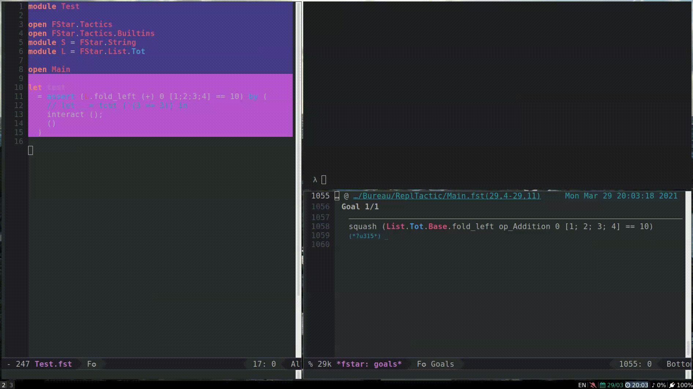

# F* tactic REPL

Requires https://github.com/FStarLang/FStar/pull/2260

## Usage

- run first `repl.sh`
- then try to verify in emacs the block with the `interact` call in `Test.fst`
- you get a repl

